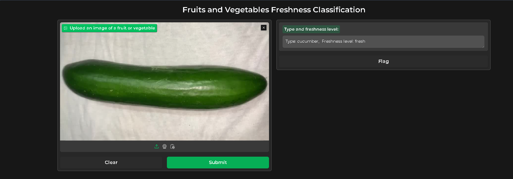

 we aimed to address the significant global issue of food waste by developing a deep learning model to classify the freshness and healthiness of fruits and vegetables. Our approach utilized VGG16 for assessing freshness and EfficientNet-B0 for detecting diseases in tomatoes.

We employed the FruitVeg dataset, which consists of 60,059 images of 11 different fruits and vegetables categorized into three freshness levels: fresh, medium-fresh, and rotten. For disease detection, we used the PlantVillage dataset, containing 18,160 images of tomato leaves classified into nine disease categories and one healthy category.

Our VGG16 model achieved a test accuracy of 94.58% for freshness classification, while EfficientNet-B0 reached an impressive accuracy of 96.04% for tomato disease detection. These results demonstrate the potential of advanced machine learning techniques in enhancing agricultural sustainability by reducing food waste and ensuring the healthiness of produce

